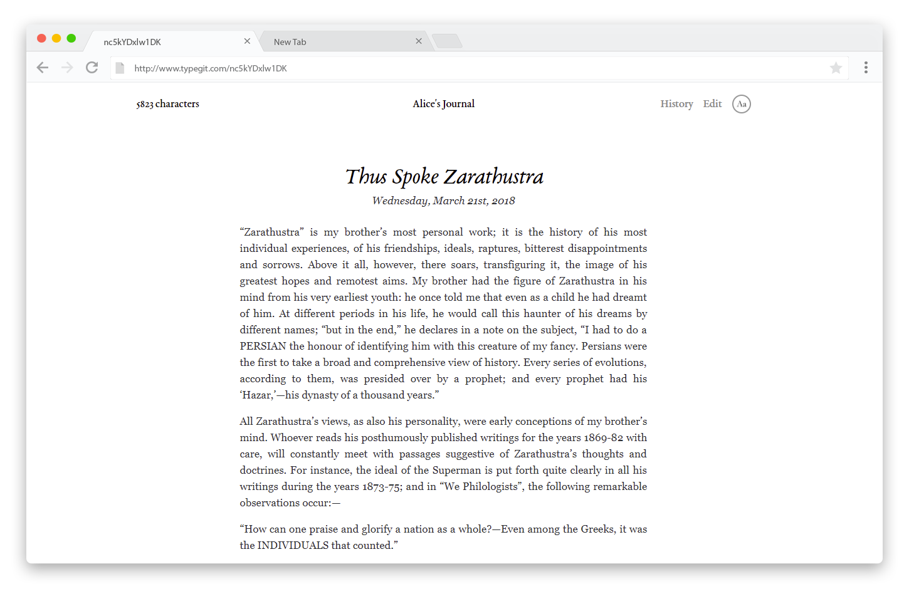
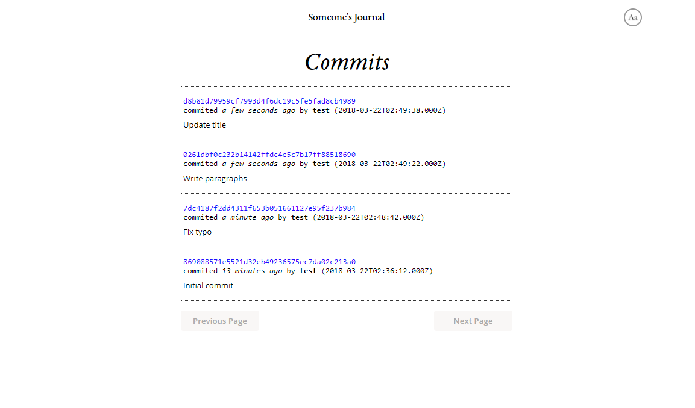

# typegit
> A diary based on git.

Every update is a git commit in a bare repo. Updates are executed with git plumbing commands.  
Call `git clone`, `git push` or `git pull` from your CLI to sync your changes with the bare repo online.

---

